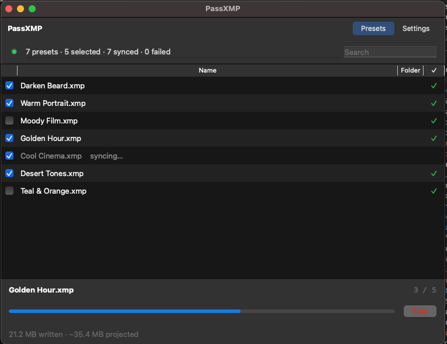

# PassXMP

**Lightroom presets → DaVinci Resolve LUTs. Automatically.**

PassXMP watches your Lightroom Classic presets folder and mirrors it as `.cube` LUT files in DaVinci Resolve's LUT directory — preserving full folder hierarchy, naming, and organization.



## Features

- **One-click sync** — pick specific presets or sync everything
- **Live watcher** — new or edited presets convert automatically in the background
- **Native macOS UI** — dark mode, two-tab layout, Finder-style file list
- **Preserves folder hierarchy** — your VSCO/Mastin/Custom organization stays intact
- **No Lightroom dependency** — parses `.xmp` directly, no Adobe runtime needed

## Installation

### From source

```bash
git clone https://github.com/maxthomason/PassXMP.git
cd PassXMP
python3.11 -m venv .venv
source .venv/bin/activate
pip install -r requirements.txt
python -m src.main
```

### Pre-built binaries

Pre-built Mac `.dmg` and Windows `.exe` binaries are not yet available — see [Releases](https://github.com/maxthomason/PassXMP/releases) for source-code tags. For now, run from source (above).

## Usage

1. Launch PassXMP
2. Open **Settings**, choose your **Lightroom Presets** folder and **DaVinci LUT** folder (auto-detected on most systems)
3. Return to **Presets** — every `.xmp` in your folder tree shows up
4. Check the presets you want to sync, click **Sync N selected**
5. Leave the app running — new presets in Lightroom convert automatically

### Presets tab

- ✓ (green) — already synced, `.cube` is up to date
- ! (red) — conversion failed (right-click → **Retry** or **Copy error message**)
- blank — not yet synced
- `syncing…` label next to a filename — in-flight

### Settings tab

- **Folders** — Lightroom + DaVinci directory pickers
- **LUT precision** — 33³ (fast, smaller files) or 65³ (higher accuracy, ~7× bigger)
- **Start on launch** — begin watching immediately when the app opens
- **Watcher** — pause/resume the background file-system watcher

### Default paths (auto-detected)

| | macOS | Windows |
|---|---|---|
| Lightroom Presets | `~/Library/Application Support/Adobe/Lightroom/Develop Presets/` | `%APPDATA%\Adobe\Lightroom\Develop Presets\` |
| DaVinci LUT | `/Library/Application Support/Blackmagic Design/DaVinci Resolve/LUT/` | `%PROGRAMDATA%\Blackmagic Design\DaVinci Resolve\Support\LUT\` |

## How it works

PassXMP uses a **Hald CLUT** approach — a mathematical identity image where every possible RGB input value is represented. The preset's color adjustments are applied to this identity, and the resulting values are written as a standard 3D LUT.

```
.xmp file changed
       |
   XMP Parser ── extracts Camera Raw Settings (CRS) parameters
       |
   Sanitizer ─── zeros non-color params (exposure, clarity, etc.)
       |
   Hald CLUT ─── generates 33³ or 65³ RGB identity array
       |
   Color Pipeline ── applies transforms in Lightroom's order
       |
   .cube Export ── writes standard 3D LUT file
       |
   Mirror ──────── places file in the matching DaVinci subfolder
```

### What translates

| Category | Parameters |
|---|---|
| White Balance | Temperature, Tint |
| Tone Curve | Parametric zones, point curves (master + RGB channels) |
| HSL / Color Mixer | Hue, Saturation, Luminance for all 8 color ranges |
| Color Grading | Shadow/Midtone/Highlight/Global wheels |
| Split Toning | Shadow/Highlight Hue and Saturation, Balance |
| Vibrance / Saturation | Global Vibrance, Saturation |

### What gets zeroed out

These can't be accurately encoded in a 3D LUT. PassXMP zeros them before conversion so the `.cube` reflects only what a LUT can represent:

| Category | Parameters |
|---|---|
| Tone / Exposure | Exposure, Contrast, Highlights, Shadows, Whites, Blacks |
| Detail | Clarity, Texture, Dehaze, Sharpness |
| Noise Reduction | Luminance Smoothing, Color Noise Reduction |
| Lens Corrections | Vignette, Chromatic Aberration |
| Transform | Upright, Lens Profile corrections |
| Effects | Grain |

> This is a limitation of the LUT format, not PassXMP. For best results, build color-focused presets — tone curve, HSL, and color grading all translate accurately.

## Requirements

- macOS 12+ (primary platform) or Windows 10+
- Python 3.11+ (to run from source)
- Lightroom Classic with Develop Presets stored locally

## Development

See [CONTRIBUTING.md](CONTRIBUTING.md) for setup, test running, and PR guidelines.

```bash
pip install -r requirements.txt -r requirements-dev.txt
python -m pytest                     # 120+ tests
python -m src.main                   # run the app
bash scripts/build_mac.sh            # build a .dmg
```

## Project structure

```
src/
├── main.py                        # Entry point
├── app.py                         # App lifecycle + sync orchestrator
├── core/
│   ├── xmp_parser.py              # XMP CRS parsing + sanitization
│   ├── hald_generator.py          # Hald identity generation
│   ├── color_transforms.py        # Color pipeline
│   ├── cube_exporter.py           # .cube writer
│   ├── sync_engine.py             # Per-file conversion
│   └── file_registry.py           # Discovered-file state (Qt model)
├── watcher/
│   ├── folder_watcher.py          # watchdog observer
│   └── mirror.py                  # Path mirroring + initial scan
├── gui/
│   ├── main_window.py             # Two-tab shell
│   ├── presets_view.py            # File table + topbar + footer
│   ├── settings_view.py           # Folders + Sync sections
│   ├── tray_icon.py               # System tray menu
│   └── widgets/
│       ├── live_dot.py            # Pulsing status dot
│       ├── status_cell.py         # Status column helpers
│       └── progress_footer.py     # Idle/active footer
├── config/
│   ├── config_manager.py          # JSON config
│   └── path_detector.py           # Auto-detect LR + DV paths
└── utils/
    └── logger.py                  # File-only logger
tests/
docs/
```

## License

MIT © 2026 Maxwell Thomason. See [LICENSE](LICENSE).

Built by [Maxwell Thomason](https://github.com/maxthomason) for the photo editing community.
